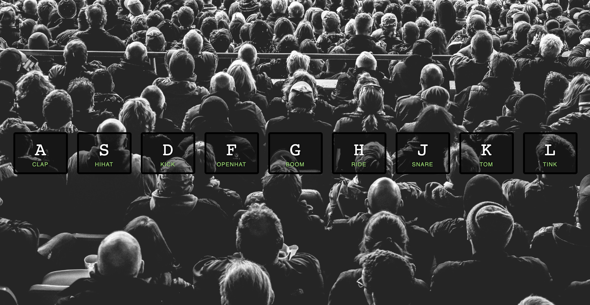

# Javascript Drumkit

---

- This small project was inspired from #javascript 30

- made a keyboard drumkit that is responsive to key strokes that make a sound and also create an animation

- used javascript, html, css 

## Installation

1. fork this repository to your own github account or download zip file
2. create local repository on github for your copy of the files
3. open with code editor of your choice
4. type "open -a "Google Chrome" index-luke.html" as terminal command to view 

---
Screen shot
